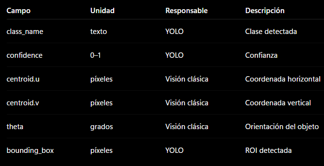

1. Objetivo

    Explicar qué resuelve el protocolo.

    Por ejemplo:

    Definir el contrato de comunicación entre el sistema de percepción ejecutado en Windows y el ecosistema ROS2 de Panthera-HT mediante TCP/IP y JSON.

2. Arquitectura
    Panthera-HT_Vision
        │
        YOLO
        │
        Visión clásica
        │
        Vision Client
        │
        TCP JSON
        │
        ▼
        Vision Bridge
        │
        DetectedObject
        │
        ROS2

3. Responsabilidades
    Cliente Windows

        Responsable de:

            adquirir imagen;
            ejecutar YOLO;
            ejecutar visión clásica;
            construir JSON;
            enviar TCP.

        Nunca:

            calcular poses del robot;
            ejecutar MoveIt;
            conocer Gazebo.

    Vision Bridge

        Responsable de:

            recibir TCP;
            validar protocolo;
            traducir JSON → ROS2;
            publicar DetectedObject.

        Nunca:

            ejecutar planificación;
            transformar coordenadas;
            mover el robot.

4. Estructura del protocolo

    Aquí iría el JSON oficial.

5. Semántica de cada campo

    

6. Versionado

    Aquí formalizaremos algo que aún no existe.

    Protocol v1

    ↓

    Compatible

    ↓

    Protocol v2

    Regla:

    El Vision Bridge será el responsable de mantener la compatibilidad entre versiones mientras sea necesario.

7. Relación con ROS2
    JSON

    ↓

    DetectedObject.msg

    ↓

    ROS2

8. Lo que el protocolo NO hace

    No estima profundidad.
    No calcula coordenadas del robot.
    No ejecuta planificación.
    No controla actuadores.
    No realiza transformaciones geométricas.